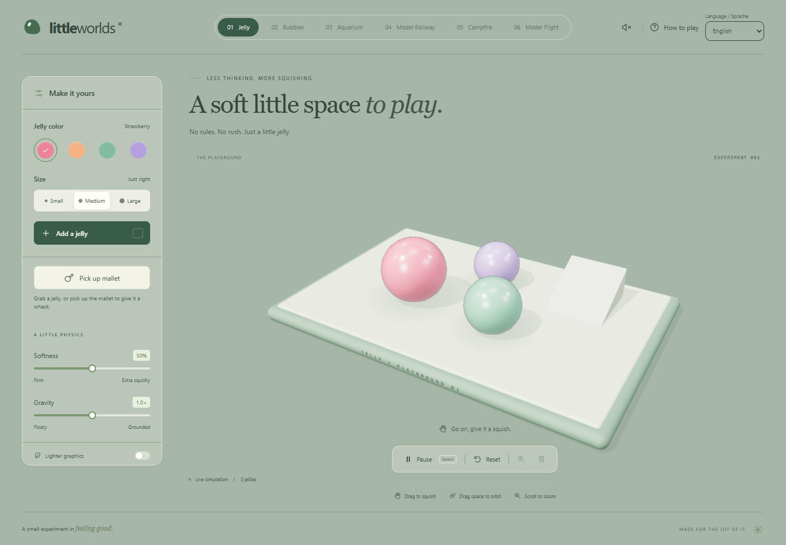
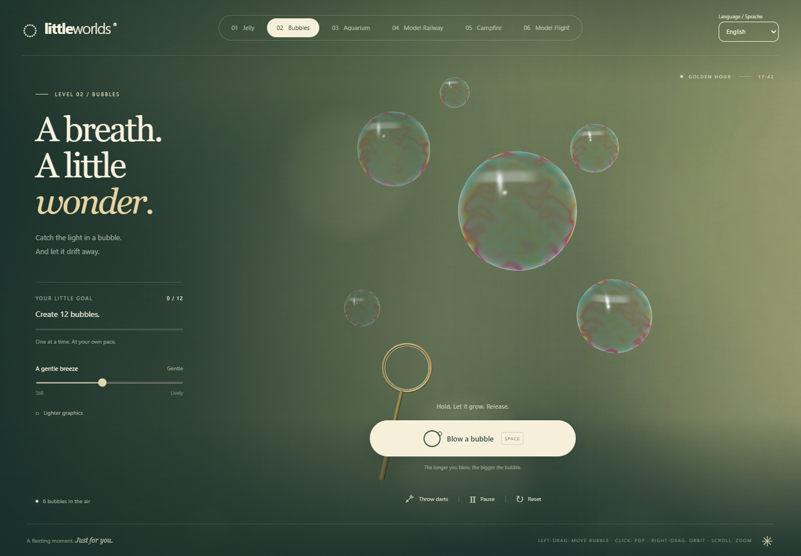
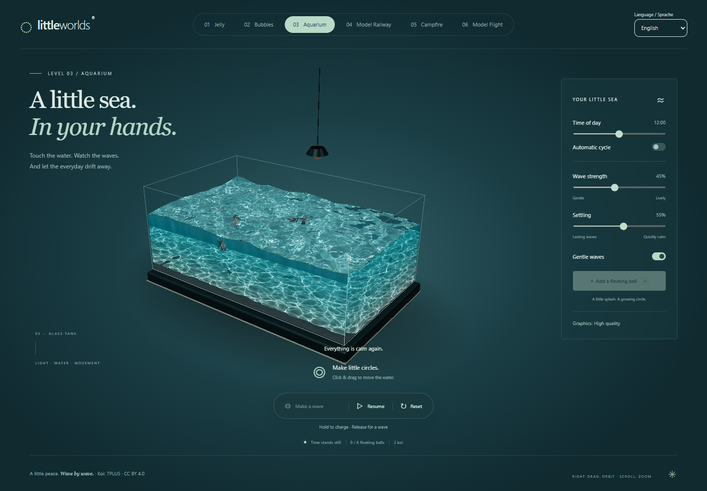
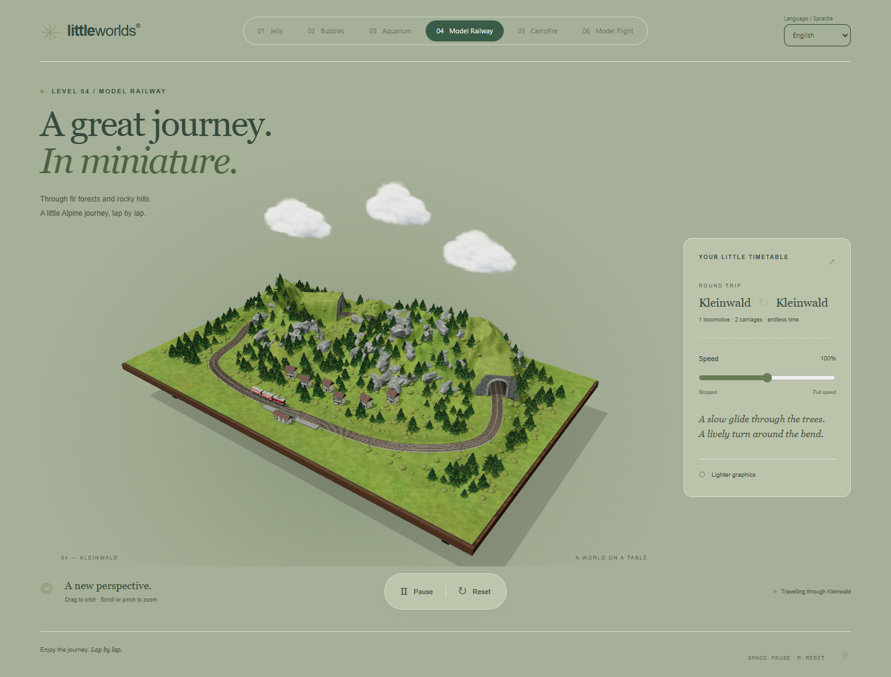
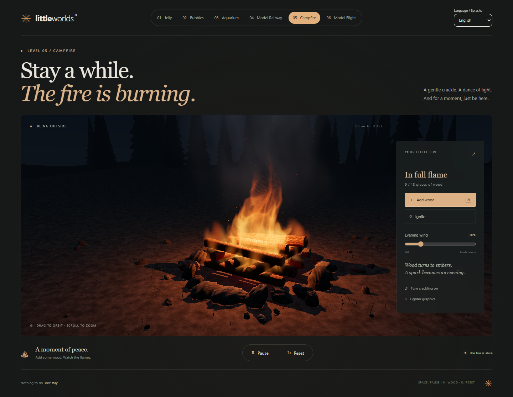
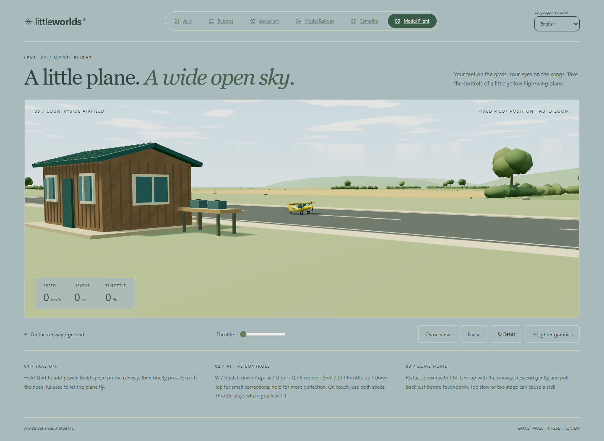
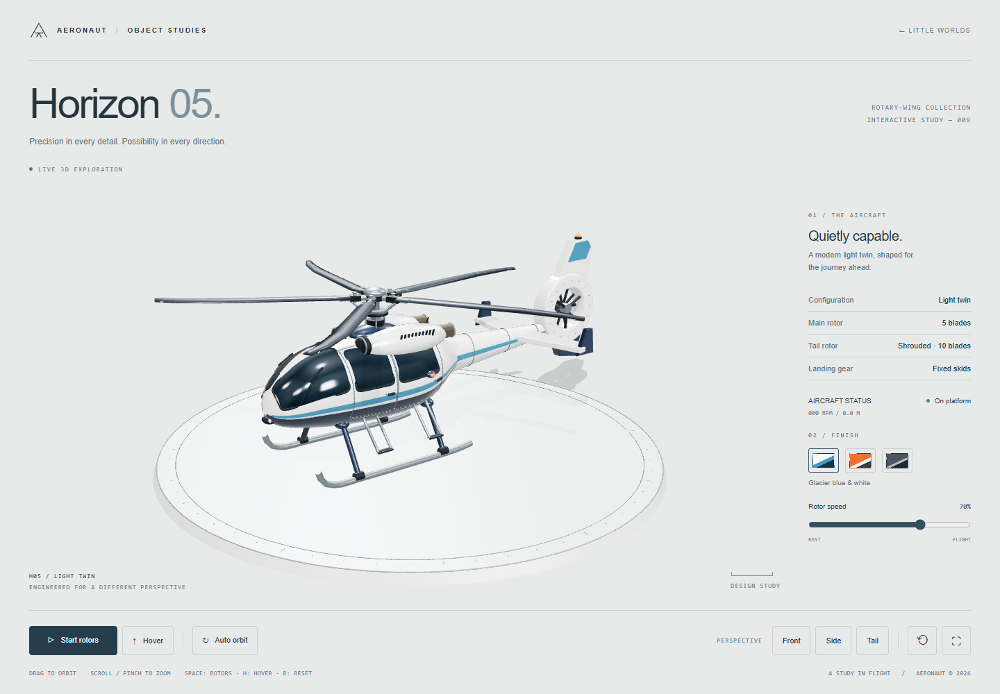

# Little Worlds

Small worlds. Play a little.

**[Play Little Worlds in your browser](https://ramnosan.github.io/little-worlds/)**

Little Worlds is a collection of nine interactive 3D playgrounds and object studies. The original worlds use TypeScript and Three.js; Melon Jelly is a standalone native WebGPU study. Stretch a jelly, blow soap bubbles, disturb the surface of an aquarium, watch a model train, tend a campfire, fly a tiny aeroplane, grow an iris garden, play with a watermelon gummy, or explore a detailed helicopter. There are no accounts, scores, or online services: each world is simply a small place to explore at your own pace.

All worlds support mouse and touch controls. The original worlds support English and German, with lighter graphics options where available; Melon Jelly and Horizon 05 follow their English object-study briefs.

## The worlds

### 01 · Jelly



Grab, stretch, toss, and stack glossy soft-body jellies in a pastel studio. Choose their colour and size, change gravity and softness, or pick up the mallet for a satisfying swing. Drag a jelly to squish it, drag empty space to orbit the scene, and scroll or pinch to zoom; **N** adds a jelly, **Space** pauses, and **R** resets the playground.

### 02 · Bubbles



Hold the blow button and release it to make an iridescent bubble—the longer the breath, the larger it grows. Bubbles drift with the breeze, bump into one another, share films, and sometimes merge; tap one to pop it or throw darts for a trickier shot. Create twelve bubbles to complete the gentle goal, then keep playing for as long as you like.

### 03 · Aquarium



Touch the water to send ripples across a glass tank filled with animated koi, shifting light, and buoyant balls. Adjust the waves, move through an eight-minute day-and-night cycle, and choose between the high-quality optical renderer and an efficient fallback. The aquarium's AI-assisted development used [CAUSTIC//VOLUME by ScottieFox](https://github.com/ScottieFox/caustic-volume) as inspiration and a technical reference; its optical equations, photon-area projection, and curved wave-detail ideas were adapted under the MIT License.

### 04 · Model Railway



Follow a red locomotive and its carriages around the miniature Alpine village of Kleinwald. The route winds past timber houses, dense forests, rocky cuttings, a bridge, and warmly lit tunnels beneath the mountains. Set the train's speed, orbit and zoom around the tabletop, pause the journey with **Space**, or send it back to the beginning with **R**.

### 05 · Campfire



Stay beside a procedural campfire as logs char, settle, and fade into embers in a dark forest clearing. Add wood, rekindle a cooling pile, change the evening wind, and turn on locally synthesized crackling after interacting with the page. The flames, smoke, sparks, firelight, bark, and ash are generated in real time without videos or imported fire effects.

### 06 · Model Flight



Fly a small yellow high-wing model aeroplane from a countryside airfield. Build speed, lift off, bank through the open sky, switch between ground and chase views, and return gently enough to keep the aircraft intact. Keyboard controls model throttle, elevator, ailerons, and rudder, while touchscreens provide a pair of familiar flight sticks.

### 07 · Plant

Plant up to twelve Dutch iris bulbs in a shallow glass soil tank. One starter bulb begins the garden; click in the planting band to add more, or select a plant to inspect its age and stage. Each bulb has its own growth rate and developing roots. Roots respond to soil resistance, stones, tank boundaries and neighbouring roots. Gentle crowding slows growth without preventing flowering.

An uncrowded iris takes about three minutes to bloom at **1×**, with **5× / 20×**, pause and elapsed time. Plants hold their first bloom while younger bulbs continue developing. **Restart clears the tank**. Left-drag to pan, right-drag to orbit around the glass soil tank, scroll or pinch to zoom, and use **Fit view** to restore the full tank. On touchscreens, two fingers pan/zoom. With the canvas focused, arrow keys move the bulb preview and Enter plants; **Space** pauses and **R** restarts.

The procedural scene uses a single high-quality renderer, bounded reusable geometry, soft shadows and translucent leaf/petal lighting. No watering, quality settings, timeline seeking or saved growth. The time and shallow root display are illustrative rather than a validated horticultural model. See the [visual guide](docs/plant-style.md) and [implementation and verification notes](docs/plant-simulation.md).

### 08 · Melon Jelly

A thick watermelon gummy with ruby flesh, pale pith, striped green rind and individually modeled seeds. Grab any part to stretch the tetrahedral soft body, release to wobble, or drag empty space to inspect both sides. Two touches can hold and twist separate parts. Colour presets, firmness, internal damping, quarter speed, mesh inspection and pause are available in the specimen panel. The canvas also supports arrow-key nudges, **Space** to pause and **R** to reset.

Open [Melon Jelly](public/melon-jelly.html), or visit `melon-jelly.html` on the running site (`?level=melon` also redirects there). **The single HTML file contains all JavaScript, CSS, geometry and WGSL**, with no external runtime dependencies. It requires genuine WebGPU and a supported graphics device; HTTPS or localhost is recommended. An explicit error explains unavailable WebGPU. Reduced-motion preferences start the simulation paused.

The CPU solves XPBD elastic and signed-volume constraints at 120 Hz with bounded catch-up, local grabs, inversion safeguards and frictional ground contact. The native WebGPU renderer uses measured back-face thickness, approximate absorption/refraction, Fresnel lighting and filtered shadow mapping. Readouts use the illustrative scale printed beneath the experiment. This level was created from a prompt by [Vib3Coded](https://x.com/vib3coded/status/2103741107225907467). See [implementation and validation notes](docs/melon-jelly.md).

### 09 · Horizon 05



A procedural light twin helicopter presented on a circular studio platform. Inspect curved, fitted glazing, door seals, rivets, twin engines, exhausts, a five-blade main rotor with pitch linkages, and a ten-blade tail rotor inside an open duct. Choose glacier blue and white, rescue orange, or graphite; start both rotors, adjust their speed, lift into a gentle hover, and land softly.

Drag to orbit, scroll or pinch to zoom, and use the front, side, tail, automatic orbit, reset, and fullscreen controls. **Space** toggles the rotors, **H** toggles hover, and **R** resets the camera; with the canvas focused, arrow keys orbit. Stopping the rotors or reducing speed below lift power first lands the aircraft. Reduced-motion preferences suppress idle sway and beacon flashing.

Open [Horizon 05](public/horizon-05.html), or use `?level=helicopter` on the running site. **The single HTML file embeds Three.js, controls, styles, geometry, and reflections and works offline**, including from `file://`. No model, texture, font, or CDN requests are needed. It requires WebGL 2 and explains unavailable graphics support. Rebuild the file after source changes with `npm run build:helicopter` (also part of `npm run build`). This level was created from a prompt by [Vib3Coded](https://x.com/vib3coded/status/2102215638311694336). See [implementation and verification notes](docs/helicopter.md).

The same collection now includes [Raptor 22](public/raptor-22.html), a procedural F-22 study, accessible through the aircraft tabs in Horizon 05. Explore the fitted reflective canopy, recessed intakes, canted tails, articulated control surfaces, twin rectangular exhausts, and retractable landing gear. Choose air-superiority gray, arctic demonstrator, or dark graphite concept. Start the engines, adjust throttle, or begin a flight display with sequenced gear retraction, gentle banking, and a soft return to the platform. **Space** toggles engines, **F** toggles flight display, and **R** resets the camera. Front, side, rear, and top presets, touch orbit/zoom, auto orbit, and fullscreen are included. The Raptor HTML also embeds all dependencies and works offline; the same build command regenerates both aircraft. See [Raptor implementation and verification notes](docs/raptor.md).

## Run locally

Little Worlds requires Node.js 20.12 or newer and npm. Install the locked dependencies and start the development server:

```sh
npm ci
npm run dev
```

Open [http://127.0.0.1:5173](http://127.0.0.1:5173) in a WebGL 2 browser with hardware acceleration. The most useful project commands are:

```sh
npm run build            # Type-check and create the production bundle
npm run preview          # Preview the production bundle locally
npm test                 # Run rendering-independent tests
npm run test:browser     # Run browser interaction and layout tests
npm run test:production  # Build and check all nine desktop/mobile layouts
```

GitHub Pages deployment is handled by [the included workflow](.github/workflows/deploy.yml). Set **Settings → Pages → Source** to **GitHub Actions**; pushes to `main` will build and publish the site under `/little-worlds/`.

## Credits

Little Worlds is built with [Three.js](https://threejs.org/) and is released under the [MIT License](LICENSE). The Aquarium adapts ideas and code from [CAUSTIC//VOLUME](https://github.com/ScottieFox/caustic-volume), also under the MIT License; its full notice is preserved in [`public/licenses/caustic-volume.txt`](public/licenses/caustic-volume.txt).

The aquarium's [Koi Fish](https://sketchfab.com/3d-models/koi-fish-236859b809984f52b70c94fd040b9c59) model is by [7PLUS](https://sketchfab.com/7plus) and is used under [CC BY 4.0](https://creativecommons.org/licenses/by/4.0/). Adaptation details are recorded in the [koi integration notes](docs/koi-integration.md).
