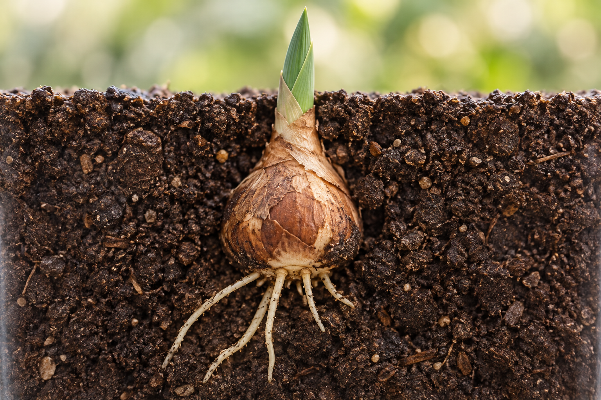
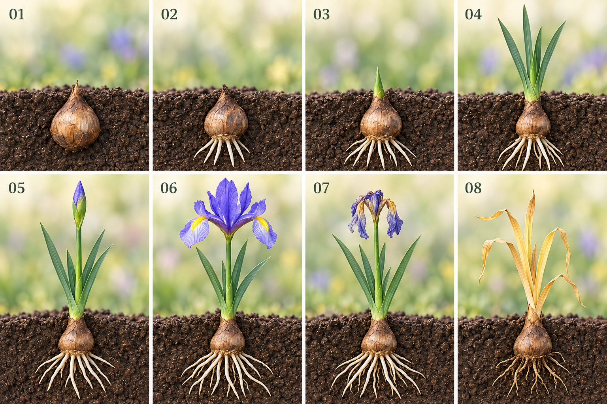
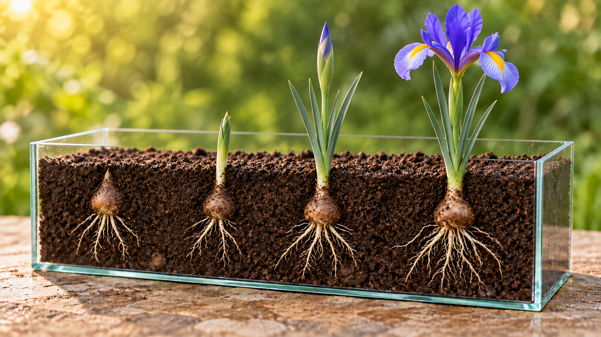
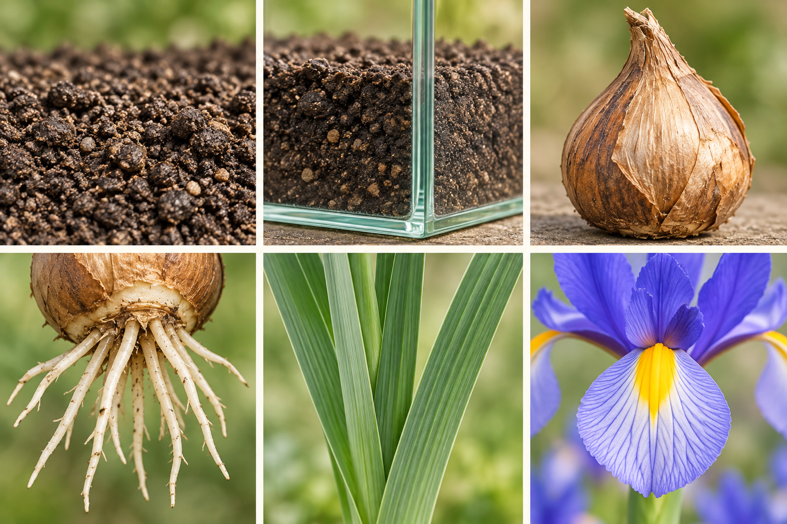
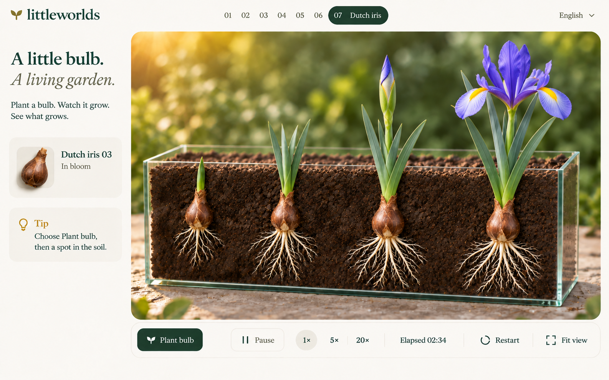
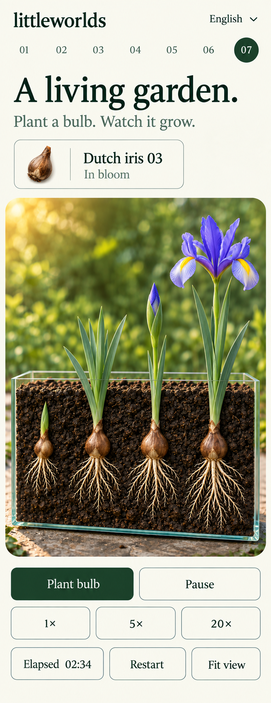
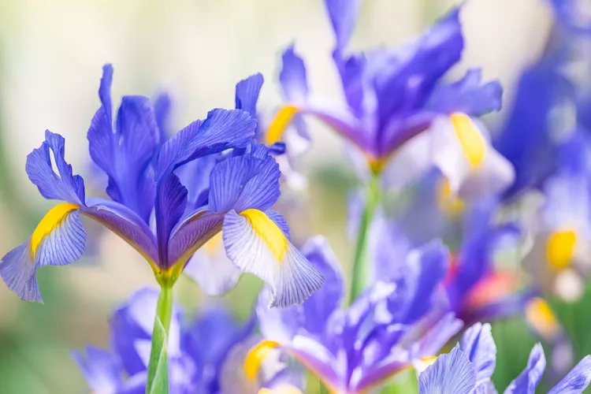

# Dutch iris — illustrated style guide

[Open the illustrated guide](plant-style.html) · [Exact generation prompts](plant-style-assets/iris-prompts.md)

**Status:** the Dutch iris simulation is implemented at `?level=plant`. Six generated images are design targets, not gameplay screenshots or botanical measurements.

## Species and scope

Use **Dutch iris (Iris × hollandica)**, with the supplied blue-violet, pale lavender and yellow flower palette. Do not infer a named cultivar from the photograph. Players now **plant mature bulbs**, not seeds. Retain the shallow 3D glass tank, multiple individually aged plants, sidebar and one high-quality renderer. Watering stays deferred.

Dutch iris is bulbous, with narrow foliage and erect flowering stems. RHS reports roughly 60cm flowering height and late-spring/early-summer flowering. [RHS profile](https://www.rhs.org.uk/plants/154520/iris-%C3%97-hollandica/details)

**Implemented sequence:** dormant bulb through first open bloom. Hold each plant there while others continue. This is a presentation choice, not the complete natural life cycle. Document fading and dormancy as research context; defer seasonal recurrence, offsets as new playable plants, watering and saved progress. Assume suitable moisture, light and planting-ready bulbs. No temperature-management mechanic or exact-days promise.

## Growth stages and appearance

This sequence is an editorial synthesis of the references, not a published eight-stage scale. Stages overlap; rooting and shoot emergence need not be strictly separated. Relative timing depends on conditions.

### 01 / Dormant bulb

Ovoid bulb with a dry brown tunic and pointed neck. No living root fan during dormancy. [Mississippi State: Dutch Iris for the Farmer Florist](https://extension.msstate.edu/sites/default/files/publications/P3740_web.pdf)

**Visual direction:** Begin with a mature, planting-ready bulb, not a seed. Keep the bulb below the soil.

### 02 / Rooting

Several pale roots emerge from the basal plate on the underside of the bulb. [University of Florida: bulb basal plate](https://propg.ifas.ufl.edu/07-geophytes/01-bulbs/01-geophytes-basalplate.html)

**Visual direction:** Extend individual root tips at unequal rates; keep every root attached to the base.

### 03 / Shoot emergence

A compact green shoot rises through the soil before the leafy plant develops. [Mississippi State: Dutch Iris for the Farmer Florist](https://extension.msstate.edu/sites/default/files/publications/P3740_web.pdf)

**Visual direction:** Show a pointed vegetative spear, not a purple flower bud or a hooked seedling. Rooting and emergence can overlap.

### 04 / Leaf growth

Narrow, smooth strap leaves overlap at the base; they have a much finer outline than broad sunflower leaves. [NC State: Dutch iris anatomy](https://plants.ces.ncsu.edu/plants/iris-x-hollandica/)

**Visual direction:** Lengthen blades from their bases with parallel veins and slight bending; no oval seed-leaf pair.

### 05 / Bud and colour tip

A slender closed bud develops on the flower stem. The pencil stage shows a small coloured tip. [Mississippi State: Dutch Iris for the Farmer Florist](https://extension.msstate.edu/sites/default/files/publications/P3740_web.pdf)

**Visual direction:** Raise the stalk, then enlarge the pointed bud within its green sheath. Do not open petals prematurely.

### 06 / Open flower

Three upright standards alternate with three spreading or drooping falls. Dutch iris is beardless; falls may carry yellow markings. [NC State: Dutch iris anatomy](https://plants.ces.ncsu.edu/plants/iris-x-hollandica/)

**Visual direction:** Match the supplied blue-violet and pale lavender reference with yellow signals. Open the parts gradually; retain threefold symmetry.

### 07 / After flowering

Flowers fade before the foliage finishes its season; the leaves remain to support the bulb. [RHS: growing bulb irises](https://www.rhs.org.uk/plants/iris/bulb/growing-guide)

**Visual direction:** Wilt the petals first while keeping leaves green. This is later-cycle research, beyond the first-bloom endpoint.

### 08 / Return to dormancy

Foliage eventually dies back; daughter bulbs can form. Dutch iris loses its living roots during rest. [Mississippi State: Dutch Iris for the Farmer Florist](https://extension.msstate.edu/sites/default/files/publications/P3740_web.pdf)

**Visual direction:** Show yellow then straw-brown leaves and fading old roots. Offsets and the following season remain a later extension.

General root attachment is based on bulb anatomy, not a Dutch-iris-specific root tracing. [University of Florida basal plate reference](https://propg.ifas.ufl.edu/07-geophytes/01-bulbs/01-geophytes-basalplate.html). Bulb scales store reserves and the tunic protects them. [Illinois Extension](https://extension.illinois.edu/flowers/bulbs). Daughter bulbs can develop, but do not imply immediate flowering from tiny offsets. [RHS cultivation guide](https://www.rhs.org.uk/plants/iris/bulb/growing-guide).

## Glass tank and composition

Use a rectangular open-topped glass cuboid, depth approximately 12% of width. Show the dominant front, narrow side, bottom pane and soil surface from a slightly elevated three-quarter frontal view. Gentle perspective, real pane thickness, subdued reflections and soft grounding shadow.

Bulbs sit entirely below soil, pointed neck upward, behind the viewing pane. Leave soil above the neck and room below for roots. Roots develop in a shallow volume against opaque soil, with granular occlusion and contact shadows. No transparent soil, floating roots, or standing water. The tank is an illustrative viewing arrangement, not a growing-container recommendation.

Keep mature iris stems slender and tall relative to bulb size. Generated bulbs are enlarged for legibility; do not treat that as a scale specification. Fit view contains the entire tank, roots and tallest flower. Use the same tank proportions on mobile. Four plants are an example, not a population limit.

## Material and colour guide

Top row: soil, glass, bulb tunic. Bottom row: roots at basal plate, leaf, flower.
Papery tan/brown tunics replace striped seed shells. Smooth narrow parallel-veined leaves replace hairy serrated blades. Ivory root clusters replace the taproot. Petals have fine veins and thin illuminated edges.

| Element         | Colour / treatment                                           |
| --------------- | ------------------------------------------------------------ |
| Page            | Warm ivory #F4F1E8                                           |
| Text / controls | Forest #253C2D; secondary #687363                            |
| Tool feedback   | Restrained gold #C99A36                                      |
| Soil            | Dark brown #30231B; irregular clumps, fibres, stones         |
| Roots           | Ivory #E8DDC0; attached individually to bulb base            |
| Glass           | Clear faces, restrained greenish edge tint                   |
| Flower          | Violet #6655C9, pale lavender #B8B4EA, yellow signal #F2C329 |

These colours are art-direction swatches, not measured cultivar colours. Keep warm upper-left light and blurred sage background. No graphics settings; optimize one high-quality renderer internally.

## Screens and controls

Retain the shipped header, navigation, language selector and desktop sidebar. Use existing sans-serif body/control text and Georgia headings. Navigation: **07 Dutch iris / 07 Holländische Iris**, retaining the plant route. Sidebar shows short instructions, selected plant identity, time since planting and stage.

**Plant bulb · Pause/Resume · 1× · 5× · 20× · Elapsed time · Restart · Fit view.**

No Water control, moisture meter, percentage completion or backward timeline. Elapsed time is shared; ages are per bulb. Restart clears the bed. Space toggles playback and R restarts outside focused controls. Hidden tabs suspend growth without catch-up.

Mobile stacks compact information, scene and controls. Scene at least 420px high; touch targets at least 44px. Keep flowers and planting space unobstructed. Wheel/pinch zoom, right-drag/two-finger pan; Fit view restores full-tank framing.

## Planting feedback and motion

1. **Aim:** gold point-up bulb preview in a valid buried location behind the front pane. Leave soil above the neck. Reject overlap and out-of-tank positions.
2. **Place:** click/tap plants a brown papery bulb at that location, selects it and starts its own age.
3. **Develop:** roots extend from their tips; leaf blades lengthen from bases; stalk rises; bud swells and flower parts unfold continuously.

No cloned root ladders, synchronized plants, whole-plant scaling or sudden flower appearance.

## Supplied flower reference

Use flower colour, fine veining and petal delicacy from this reference. Preserve three standards and three falls; yellow signals are not a fuzzy beard. The separate petal-like style arms should not be mistaken for extra standards. [NC State anatomy](https://plants.ces.ncsu.edu/plants/iris-x-hollandica/)

## Review and provenance

Inspect bulb, roots, shoot, leaves, bud and bloom on desktop and mobile. Verify root/base attachment, smooth narrow leaves, six principal flower parts, all tank edges in frame, clear controls, image loading and no overflow. Stage 03 must remain a plain green vegetative shoot. Later-cycle images explain biology and do not expand the playable endpoint.

Six concepts generated with the built-in image-generation tool on 2026-09-27; the stage board received a corrective edit. [Exact prompts](plant-style-assets/iris-prompts.md). Older sunflower assets remain archived and are superseded.

Research sources checked 2026-09-27:

- [RHS: Dutch iris profile](https://www.rhs.org.uk/plants/154520/iris-%C3%97-hollandica/details)
- [NC State: Dutch iris anatomy](https://plants.ces.ncsu.edu/plants/iris-x-hollandica/)
- [Mississippi State: Dutch Iris for the Farmer Florist](https://extension.msstate.edu/sites/default/files/publications/P3740_web.pdf)
- [University of Florida: bulb basal plate](https://propg.ifas.ufl.edu/07-geophytes/01-bulbs/01-geophytes-basalplate.html)
- [RHS: growing bulb irises](https://www.rhs.org.uk/plants/iris/bulb/growing-guide)
- [Illinois Extension: bulb structure](https://extension.illinois.edu/flowers/bulbs)

Implementation and measured validation: [plant-simulation.md](plant-simulation.md).
