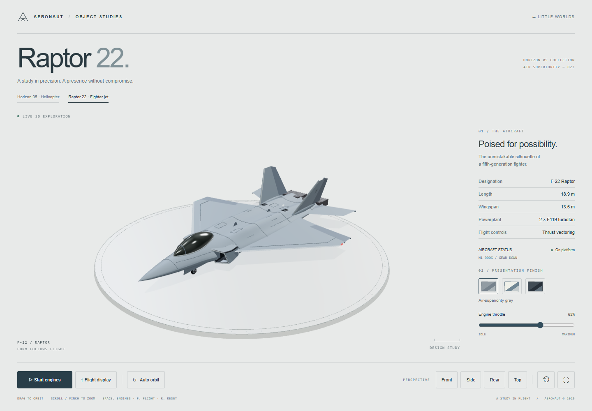

# Raptor 22

An F-22 exterior design study within the Horizon 05 collection. It is a procedural presentation model, not an engineering replica or a flight simulator. The specifications shown in the panel (18.9 m length, 13.6 m wingspan, twin F119 engines) follow the [US Air Force F-22 fact sheet](https://www.af.mil/About-Us/Fact-Sheets/Display/Article/104506/f-22-raptor/).

## Files and integration

- `public/raptor-22.html`: the complete offline deliverable. Three.js, OrbitControls, RoomEnvironment, geometry, styles and shaders are embedded; no remote models, textures, fonts or scripts are requested.
- `src/raptor/template.html`: English interface and responsive layout.
- `src/raptor/aircraft.js`: shared materials and primitives, hull loft, fitted canopy, intake ducts, wings, hinged surfaces, exhaust assemblies, gear and doors.
- `src/raptor/scene.js`: studio, camera, controls, animation, heat distortion, fallback and lifecycle handling.
- `scripts/build-helicopter.mjs`: builds both aircraft studies, retaining the Three.js MIT license.

Open Horizon 05 and choose the Raptor aircraft tab, or open `raptor-22.html` directly. Relative links support both the development server and the production `/little-worlds/` base path. A downloaded Raptor file contains the complete Raptor experience; navigation to the helicopter or other worlds requires those files alongside it.

## Geometry and motion

The main hull uses longitudinal cross sections, with engine shoulders integrated into the upper surface. Panel seams and canopy boundary vertices share its surface function. The tinted glazing uses reflective physical material; it does not simulate a transparent cockpit interior. Root overlaps bury structural joints in the fuselage. Wings have solid thickness, separate hinged trailing surfaces, and spanwise tailplane spindles. The fins are canted and have rudders on oblique hinge axes. Intake mouths have lips, inner ducts, outer skins and recessed compressor geometry; hull openings prevent it from sealing their mouths. Rectangular exhausts have dark throats, serrated petals, grooves, and animated pitch deflection.

Gear wells cut through the lower hull and include roofs, walls, hinged doors, braces, hydraulic struts, hoses, tires, hubs and a nose lamp. The reversible six-second flight timeline lifts the aircraft before retracting its gear and closing the doors. Returning opens the doors and extends the gear at altitude, levels the airframe, and lowers all three wheels onto the platform. Stopping engines during a display completes this sequence before final spool-down. The throttle ranges from engine idle to maximum; zero throttle leaves an explicitly started engine idling.

Animation uses elapsed seconds and exponential engine/camera transitions. Reduced motion suppresses banking, pitch, sway and heat shimmer; engines and flight begin only after an explicit action. Mouse, touch and keyboard controls are available. Settings move beneath the scene on narrow screens. Orbiting underneath automatically hides the display base so the belly remains inspectable.

PBR materials use a locally generated PMREM studio environment. Shadows, an instanced platform scale, shared materials/geometries and a 1.5 pixel-ratio cap control rendering cost. Engine exhaust volumes sample an intermediate studio render for subtle distortion; that extra render is skipped when engines are off or reduced motion is enabled. WebGL initialization failure leaves navigation available and explains how to enable graphics support. Context loss pauses the scene; background tabs suspend animation. GPU resources are released when leaving the page, with back-forward cache restoration supported.

## Verification

`npx playwright test tests/browser/raptor.spec.ts tests/browser/helicopter.spec.ts` checks aircraft navigation, initial framing, finishes, gradual engine start/stop, throttle limits, reversible gear sequencing, landing before shutdown, surface/nozzle animation, all camera controls, fullscreen, keyboard input, mobile touch and pinch, 320 px layout, reduced motion, offline `file://` loading and WebGL fallback. Browser errors are collected throughout.

`node scripts/inspect-raptor.mjs` saves default, front, side, rear, opposite side, top, underside, flight, alternate finish, and mobile screenshots to `artifacts/raptor/` for visual review. `npm run test:production` also checks the Raptor in the built site's base path. Read-only diagnostic values are exposed only with `?inspect`.
